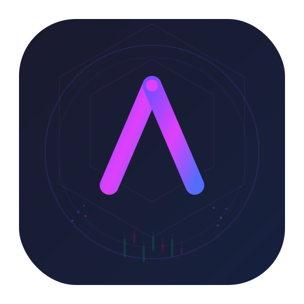

<p align="center">
  <picture>
    <source media="(prefers-color-scheme: dark)" srcset="./src/assets/icon.svg">
    
  </picture>
</p>

<h1 align="center">AetherQuant</h1>

<p align="center">
  <a href="https://github.com/oxroot-crypto/aetherquant/blob/master/LICENSE">
    
  </a>
  <a href="https://vuejs.org">
    
  </a>
  <a href="https://www.typescriptlang.org">
    
  </a>
  <a href="https://v2.tauri.app">
    
  </a>
  <a href="https://vite.dev">
    
  </a>
  <a href="https://hyperliquid.xyz">
    
  </a>
</p>

<p align="center">
  <strong>Cryptocurrency K-Line Quantitative Analysis Platform</strong>
  <br />
  <sub>Real-time · Plugin-driven · Cross-platform</sub>
</p>

<p align="center">
  <strong>English</strong> ·
  <a href="./README.zh.md">简体中文</a>
</p>

<p align="center">
  <a href="#features"><strong>Features</strong></a> ·
  <a href="#quick-start"><strong>Quick Start</strong></a> ·
  <a href="#architecture"><strong>Architecture</strong></a> ·
  <a href="#plugin-system"><strong>Plugins</strong></a> ·
  <a href="#contributors"><strong>Contributors</strong></a>
</p>

---

## Overview

AetherQuant is a desktop-grade cryptocurrency technical analysis workstation. It renders interactive candlestick charts, runs five independent quantitative strategies in parallel, and aggregates their output into a unified consensus rating — all fed by live market data from Hyperliquid DEX over a persistent WebSocket connection.

The entire system is plugin-driven: swap exchanges to pull data from a different venue, or plug in your own strategy module without touching the core.

## Features

<table>
  <tr>
    <td width="50%">
      <h4>Chart</h4>
      <ul>
        <li>TradingView <code>lightweight-charts</code> rendering</li>
        <li>Candlestick + volume dual-pane layout</li>
        <li>MA indicator overlay (MA7 / MA25)</li>
        <li>Crosshair hover legend (OHLC + change %)</li>
        <li>Keyboard shortcuts — <kbd>R</kbd> reset, <kbd>+</kbd>/<kbd>-</kbd> zoom, <kbd>&larr;</kbd><kbd>&rarr;</kbd> pan, <kbd>F</kbd> fit</li>
        <li>Adjustable candle window (50 – 500)</li>
        <li>Auto-zoom to most recent 60 bars</li>
      </ul>
    </td>
    <td width="50%">
      <h4>Analysis Engine</h4>
      <ul>
        <li><b>MA Crossover</b> — Golden Cross / Death Cross (MA7 & MA25)</li>
        <li><b>MACD</b> — Momentum & signal line (12, 26, 9)</li>
        <li><b>RSI</b> — Overbought / oversold oscillator (14)</li>
        <li><b>Bollinger Bands</b> — Volatility & squeeze (20, 2)</li>
        <li><b>EMA Multi-TF</b> — Multi-timeframe alignment (9, 21, 50)</li>
      </ul>
      <p>Each strategy emits a 0–100 score mapped to a 5-tier rating.</p>
    </td>
  </tr>
  <tr>
    <td>
      <h4>Data Pipeline</h4>
      <ul>
        <li>Hyperliquid <code>POST /info</code> candle snapshots</li>
        <li>Persistent WebSocket (<code>wss://api.hyperliquid.xyz/ws</code>)</li>
        <li>Single-connection lifecycle — unsub/resub on switch</li>
        <li>Auto-reconnect with re-subscription on drop</li>
        <li>Full coin universe via <code>meta</code> endpoint (100+ pairs)</li>
      </ul>
    </td>
    <td>
      <h4>UI / UX</h4>
      <ul>
        <li>Frameless custom title bar with window controls</li>
        <li>Dark / light theme (CSS variables, persisted)</li>
        <li>Searchable symbol selector with real-time filtering</li>
        <li>English / Chinese i18n with language dropdown</li>
        <li>Live connection status indicator in toolbar</li>
        <li>Responsive layout — chart + collapsible side panel</li>
      </ul>
    </td>
  </tr>
</table>

### Scoring Model

| Score | Rating | Interpretation |
| ----: | :----- | :------------- |
| 70 – 100 | Bullish | Strong Buy |
| 55 – 70 | Slightly Bullish | Buy |
| 45 – 55 | Neutral | Hold |
| 30 – 45 | Slightly Bearish | Sell |
| 0 – 30 | Bearish | Strong Sell |

The consensus rating is the arithmetic mean of all active strategy scores.

## Tech Stack

| Layer | Stack |
| :---- | :---- |
| UI Framework | Vue 3 (Composition API, `<script setup>`) |
| Language | TypeScript (strict) |
| Charting | `lightweight-charts` v5 (TradingView) |
| i18n | `vue-i18n` v10 |
| Styling | CSS Custom Properties (light / dark) |
| Bundler | Vite 8 |
| Desktop Shell | Tauri 2 (Rust backend) |
| Market Data | Hyperliquid DEX (HTTP + WebSocket) |

## Quick Start

```bash
# Prerequisites: Node.js ≥ 18, Rust toolchain

# Browser development
npm install
npm run dev                # http://localhost:5173

# Desktop development
npm run tauri:dev

# Production distribution
npm run tauri:build        # → src-tauri/target/release/bundle/
```

> **Windows:** requires MSVC build tools + Windows SDK for the Rust backend.

## Architecture

```
src/
├── components/          Vue 3 SFCs
│   ├── TitleBar.vue     Custom frameless title bar + window controls
│   ├── Toolbar.vue      Symbol / interval / limit selectors + WS indicator
│   ├── CoinSelector.vue Searchable dropdown (100+ pairs, real-time filter)
│   ├── KlineChart.vue   Candlestick + volume + MA overlay + legend
│   ├── AnalysisPanel.vue Strategy cards with scores, signals, indicators
│   └── RatingBadge.vue  Colored rating pill
├── composables/         Logic hooks
│   ├── useChart.ts      lightweight-charts lifecycle & indicator API
│   ├── useRealtime.ts   Hyperliquid persistent WebSocket manager
│   ├── useAnalysis.ts   Strategy execution pipeline
│   ├── useTheme.ts      Dark/light toggle + persistence
│   ├── useTauri.ts      Native window API abstraction
│   └── usePlugins.ts    Reactive plugin state
├── plugin-system/
│   └── PluginManager.ts Registry, activation, pub/sub
├── plugins/
│   ├── exchanges/
│   │   └── hyperliquid.ts
│   └── strategies/
│       ├── ma-strategy.ts
│       ├── macd-strategy.ts
│       ├── rsi-strategy.ts
│       ├── bollinger-strategy.ts
│       └── ema-strategy.ts
├── locales/             zh.ts / en.ts
├── types/               Shared TypeScript interfaces
├── themes.css           CSS variable definitions (dark + light)
├── App.vue              Root — wiring, WS lifecycle, indicator dispatch
├── i18n.ts              i18n instance + locale persistence
└── main.ts              Entry point

src-tauri/               Tauri (Rust) backend
├── src/                 lib.rs, main.rs
├── icons/               App icons (ico, icns, png)
├── Cargo.toml
└── tauri.conf.json      Window config (frameless, 1400×900)
```

### Data Flow

```
HTTP fetchData  ──→  data[]  ──→  KlineChart.setData()
                                      │
WS onCandle  ──→  merge  ──→  data[] ──→  KlineChart.setData()
                                      │
                                      ├──  plotIndicators()  (MA lines)
                                      └──  run(slice)        (quant analysis)
```

### WebSocket Lifecycle

```
connect(BTC, 1h)
  ├── unsubscribe old (if any)
  ├── subscribe { candle, BTC, 1h }
  │
  ├── onmessage → Number() coerce → filter by coin/interval → onCandle()
  │
  ├── switch to (ETH, 15m)
  │     ├── unsubscribe { candle, BTC, 1h }
  │     └── subscribe   { candle, ETH, 15m }
  │         (same WebSocket, no reconnect)
  │
  └── onclose → 3s delay → reconnect → onopen → re-subscribe current
```

## Plugin System

Plugins implement a typed interface and register with the `PluginManager`. The host application never imports plugin internals directly — it only talks to the manager.

### Strategy Plugin

```ts
import type { StrategyPlugin } from '@/types'

export const myStrategy: StrategyPlugin = {
  id: 'my-strategy',
  name: 'My Strategy',
  version: '1.0.0',
  type: 'strategy',
  description: 'Description',
  analyze(data) {
    return {
      strategyId: 'my-strategy',
      strategyName: 'My Strategy',
      rating: 'bullish',       // 'bearish' | 'slightly_bearish' | 'neutral' | ...
      score: 75,                // 0 – 100
      signals: [{ type: 'buy', message: 'Signal text', timestamp: Date.now() }],
      indicators: [{ name: 'Value', value: 1.23, displayValue: '1.23' }],
      summary: 'Analysis result',
      timestamp: Date.now(),
    }
  },
}

// Activate
pluginManager.registerStrategy(myStrategy)
```

### Exchange Plugin

```ts
import type { ExchangePlugin } from '@/types'

export const myExchange: ExchangePlugin = {
  id: 'my-exchange',
  name: 'My Exchange',
  version: '1.0.0',
  type: 'exchange',
  description: 'Custom exchange adapter',
  async fetchData(symbol, interval, limit) { /* → OHLCV[] */ },
  async fetchRange?(symbol, interval, start, end) { /* → OHLCV[] */ },
  subscribe?(symbol, interval, onCandle) { /* → unsubscribe fn */ },
  getSupportedSymbols() { return ['BTC/USDT', 'ETH/USDT'] },
  getSupportedIntervals() { return ['1m', '5m', '15m', '1h', '4h', '1d'] },
}

pluginManager.registerExchange(myExchange)
pluginManager.setActiveExchange('my-exchange')
```

## Contributors

<table>
  <tr>
    <td align="center">
      <strong>oxroot</strong><br />
      <sub>Project Author</sub><br />
      <sub>Architecture · Strategy Algorithms · Direction</sub>
    </td>
    <td align="center">
      <strong>Claude Code</strong><br />
      <sub>Engineering</sub><br />
      <sub>Full-stack Implementation · UI/UX · Tooling</sub>
    </td>
  </tr>
</table>

## License

MIT © 2025 oxroot. See [LICENSE](./LICENSE) for full text.
